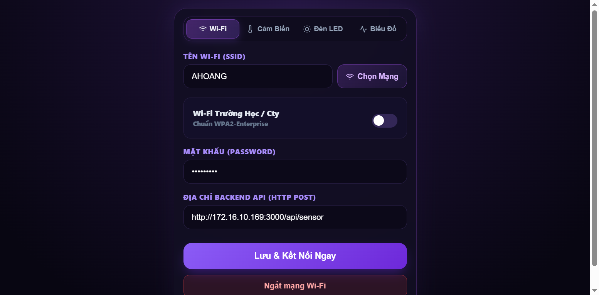
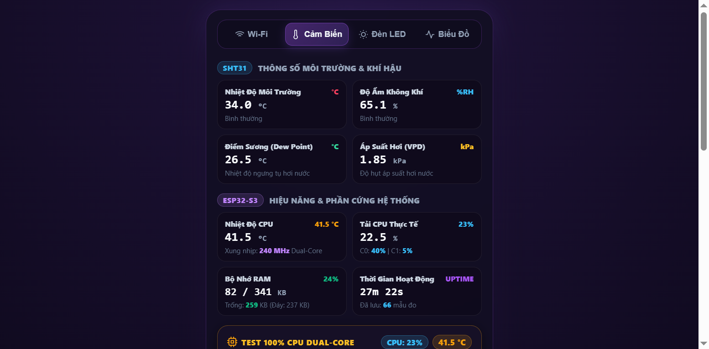
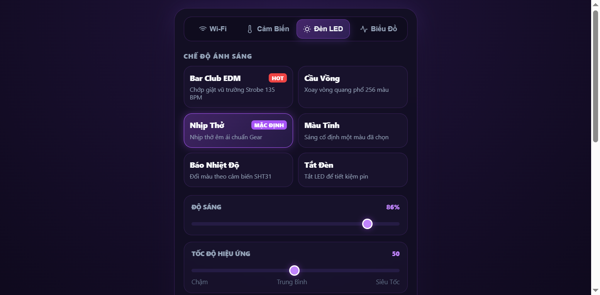
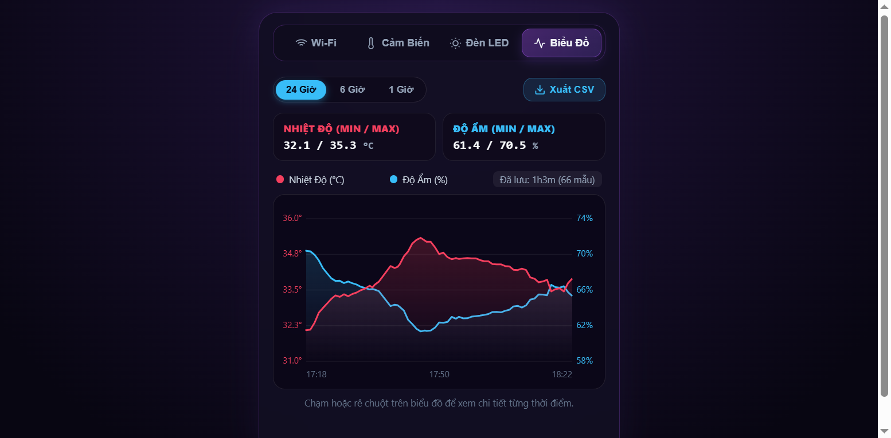

<div align="center">

# 🌡️ ESP32-S3 IoT Environment Monitor

**Real-time environment monitoring system with RGB LED control, Captive Portal, and dual-core stress testing**

[](https://platformio.org/)
[](https://github.com/espressif/esp-idf)
[](LICENSE)
[](https://github.com/phuche2004/esp32-s3-sensor)

[Features](#-features) • [Hardware](#%EF%B8%8F-hardware-requirements) • [Installation](#-installation) • [Usage](#-usage) • [API](#-api-reference) • [Contributing](#-contributing)

</div>

---

## 📸 Demo

### Web Interface Tabs

<div align="center">

| WiFi Setup | Dashboard |
|:----------:|:---------:|
|  |  |
| Configure WiFi credentials & backend server | Real-time sensor data & system monitoring |

| LED Control | History Chart |
|:-----------:|:-------------:|
|  |  |
| 6 animation modes with color picker | Temperature & humidity trend graph |

</div>

---

## ✨ Features

- 🌡️ **SHT31 Sensor Integration** - High-precision temperature (±0.2°C) and humidity (±2% RH) monitoring with I2C CRC-8 verification
- 🎨 **WS2812 RGB LED Controller** - 6 animation modes with Gamma 2.8 color correction (100 Hz refresh rate)
  - Static Color, Breathing, Rainbow, Strobe, Temperature Reactive
- 📡 **Captive Portal** - Auto-setup WiFi with mobile-optimized Web UI
- 🔐 **WPA2-Enterprise Support** - 802.1x EAP-PEAP authentication for enterprise networks
- 📊 **Real-time Telemetry** - HTTP POST streaming to custom backend server
- 🔥 **Dual-Core Stress Test** - CPU load monitoring with FreeRTOS Idle Hooks
- ⚡ **FreeRTOS Task Management** - Core 0: LED PWM (deterministic), Core 1: Network stack
- 🌐 **mDNS Responder** - Access via `http://esp.local`
- 💾 **Persistent Storage** - Configuration saved to NVS Flash
- 🚨 **Alert System** - Buzzer + LED flash when thresholds exceeded

---

## 🛠️ Hardware Requirements

| Component | Specification |
|-----------|---------------|
| **MCU** | ESP32-S3 (Dual-Core Xtensa LX7 @ 240MHz) |
| **Flash** | 16MB QSPI |
| **PSRAM** | 8MB OPI |
| **Sensor** | Sensirion SHT31-DIS (I2C, 0x44) |
| **LED** | WS2812 RGB (built-in or external) |
| **Buzzer** | Active Buzzer (5V) |
| **Button** | BOOT button (GPIO 0) for WiFi reset |

### 📌 Pinout

| GPIO | Device | Protocol | Description |
|------|--------|----------|-------------|
| `8` | SHT31 SDA | I2C (400kHz) | Data line |
| `9` | SHT31 SCL | I2C (400kHz) | Clock line |
| `10` | Buzzer | Digital Out | Alert buzzer |
| `13` | Status LED | Digital Out | System status |
| `48` | WS2812 | RMT | RGB LED data |
| `0` | BOOT Button | Input Pull-up | Hold >1s to reset WiFi |

---

## 🚀 Installation

### Prerequisites

- [PlatformIO Core](https://platformio.org/) or [PlatformIO IDE](https://platformio.org/platformio-ide)
- USB cable for flashing
- Python 3.7+ (for telemetry server)

### Quick Start

1. **Clone repository**
   ```bash
   git clone https://github.com/phuche2004/esp32-s3-sensor.git
   cd esp32-s3-sensor
   ```

2. **Build & Upload**
   ```bash
   pio run -t upload
   ```

3. **Monitor Serial Output**
   ```bash
   pio device monitor -b 115200
   ```

### Complete Build Commands


```bash
# Build only (verify code)
pio run

# Upload to device (auto-detect COM port)
pio run -t upload

# Upload + Monitor (Windows: COM3, Linux/Mac: /dev/ttyUSB0)
pio run -t upload -t monitor

# Clean build files
pio run -t clean

# List available serial ports
pio device list
```

---

## 📱 Usage

### First-Time Setup

1. **Connect to WiFi**
   - Power on ESP32-S3
   - Connect to WiFi AP `ESP32-S3` (open network)
   - Browser will auto-redirect to Captive Portal
   - Enter WiFi credentials (WPA2-PSK or WPA2-Enterprise)

2. **Access Web Interface**
   - After connection: `http://esp.local` or `http://<device-ip>`
   - Navigate through 4 tabs:
     - 📶 **WiFi Setup** - Network configuration
     - 📊 **Dashboard** - Real-time sensor data
     - 🎨 **LED Control** - RGB animation settings
     - 📈 **History** - Temperature/Humidity chart (last 32 data points)

### WiFi Reset

Hold BOOT button for **>1 second** to clear saved WiFi credentials and restart in AP mode.

---

## 🎨 LED Animation Modes

| Mode | Description | Example Use Case |
|------|-------------|------------------|
| `0` | Off | Power saving |
| `1` | Static Color | Custom ambient light |
| `2` | Breathing | Default purple cyberpunk aesthetic |
| `3` | Rainbow | Party mode, full spectrum |
| `4` | Strobe | EDM club effect (135 BPM) |
| `5` | Temperature Reactive | Visual temperature indicator (Blue→Yellow→Red) |

All modes support **brightness** (0-255) and **speed** (1-10) adjustment.

---

## 📡 API Reference

### Sensor Data

**GET** `/sensor`

Response:
```json
{
  "temp": 34.2,
  "hum": 65.5,
  "valid": true,
  "alert": false,
  "chipTemp": 45.3,
  "cpu": 2.1,
  "cpu0": 1.8,
  "cpu1": 2.4,
  "stressActive": false,
  "stressSec": 0
}
```

### LED Control

**GET** `/api/led` - Get current LED config

**POST** `/api/led` - Set LED config
```json
{
  "mode": 2,
  "r": 168,
  "g": 85,
  "b": 247,
  "brightness": 128,
  "speed": 5
}
```

**POST** `/api/led/reset` - Reset to default (purple breathing)

### Sensor Configuration

**GET** `/api/sensor-cfg` - Get thresholds and intervals

**POST** `/api/sensor-cfg` - Update config
```json
{
  "temp_alert": 35.0,
  "hum_alert": 80.0,
  "read_interval": 2,
  "send_interval": 10
}
```

### WiFi Management

**GET** `/scan` - Scan nearby WiFi networks

**POST** `/save` - Save WiFi credentials
```json
{
  "ssid": "MyNetwork",
  "password": "password123",
  "is_ent": false,
  "username": "",
  "backend": "http://192.168.1.100:3000/api/data"
}
```

**POST** `/shutdown-ap` - Disable Access Point (keep Station mode)

### Stress Test

**POST** `/api/stress-test` - Start/stop CPU stress test
```json
{
  "action": "start"  // or "stop"
}
```

**GET** `/api/stress-test` - Get stress test status

---

## 🔧 Telemetry Server

A Python Flask server is included for receiving telemetry data.

**Start server:**
```bash
cd esp32-s3-sensor
python server.py
```

Server listens on `http://0.0.0.0:3000/api/data`

**Payload format:**
```json
{
  "temperature": 34.2,
  "humidity": 65.5,
  "chip_temperature": 45.3,
  "cpu_load": 2.1,
  "alert": false,
  "timestamp": 1234567890
}
```

---

## 🏗️ Architecture

### Dual-Core Task Distribution

```
ESP32-S3 (240MHz Dual-Core)
├── Core 0 (Deterministic)
│   ├── LED PWM Task (100Hz)
│   ├── Gamma 2.8 LUT
│   └── WiFi MAC Driver
└── Core 1 (Network Stack)
    ├── HTTP Server (Port 80)
    ├── DNS Server (Captive Portal)
    ├── SHT31 I2C Driver
    └── Telemetry Client
```

### Project Structure

```
esp32-s3-sensor/
├── include/
│   └── Config.h              # Pin definitions & constants
├── src/
│   ├── main.cpp              # Entry point & FreeRTOS setup
│   ├── drivers/              # Hardware abstraction layer
│   │   ├── SHT31Sensor.cpp   # Temperature/Humidity sensor
│   │   ├── RgbController.cpp # WS2812 LED driver (Core 0)
│   │   ├── Alarm.cpp         # Buzzer controller
│   │   ├── DataLogger.cpp    # History buffer (32 samples)
│   │   └── StressTester.cpp  # CPU stress test utility
│   └── network/              # Network stack
│       ├── WiFiService.cpp   # WiFi STA/AP management
│       ├── CaptivePortal.cpp # HTTP server & API routes
│       ├── TelemetryService.cpp # HTTP POST client
│       ├── StorageManager.cpp   # NVS Flash read/write
│       └── web/              # Embedded Web UI (HTML/CSS/JS)
│           ├── WebPage.h
│           ├── WebStyles.h
│           └── WebScript.h
├── platformio.ini            # PlatformIO config
├── server.py                 # Python telemetry receiver
└── README.md
```

---

## 🔬 Technical Details

### Color Correction

RGB values undergo **Gamma 2.8 correction** using a 256-entry lookup table based on CIE 1931 standard:

```cpp
gamma_lut[i] = pow(i / 255.0, 2.8) * 255;
```

This ensures perceptually linear brightness transitions.

### CPU Load Calculation

FreeRTOS Idle Hooks count CPU idle cycles. Load is calculated using Exponential Moving Average (EMA):

```
CPU Load = (1.0 - idle_count / max_idle_count) × 100%
```

### I2C Communication

SHT31 sensor uses **400kHz Fast Mode** with CRC-8 verification on every read. Timeout: 500ms.

---

## 🤝 Contributing

Contributions are welcome! Please follow these steps:

1. Fork the repository
2. Create a feature branch (`git checkout -b feature/AmazingFeature`)
3. Commit your changes (`git commit -m 'Add some AmazingFeature'`)
4. Push to the branch (`git push origin feature/AmazingFeature`)
5. Open a Pull Request

### Development Guidelines

- Follow existing code style (2 spaces, camelCase for variables)
- Add comments for complex logic
- Test on real hardware before submitting PR
- Update documentation if adding new features

---

## 📝 License

This project is licensed under the MIT License - see the [LICENSE](LICENSE) file for details.

---

## 🙏 Acknowledgments

- [PlatformIO](https://platformio.org/) - Cross-platform build system
- [Adafruit](https://github.com/adafruit) - SHT31 sensor library
- [FastLED Community](https://github.com/FastLED/FastLED) - Color theory & gamma correction inspiration
- [ESP-IDF](https://github.com/espressif/esp-idf) - Espressif IoT Development Framework

---

## 📞 Support

- 🐛 **Bug Reports**: [GitHub Issues](https://github.com/phuche2004/esp32-s3-sensor/issues)
- 💬 **Discussions**: [GitHub Discussions](https://github.com/phuche2004/esp32-s3-sensor/discussions)
- 📧 **Email**: phuche2004p@gmail.com

---

<div align="center">

**[⬆ Back to Top](#-esp32-s3-iot-environment-monitor)**

Made with ❤️ by [phuche2004](https://github.com/phuche2004)

</div>
